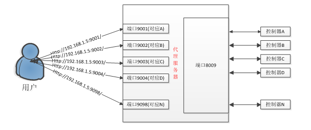

# 代理说明书

​	代理程序是一个独立的应用程序，但为了不同操作系统的兼容，只提供dll，由用户简单调用接口生成可执行程序。Dll中的代理接口以API形式提供，名为Start_Proxy()的一个函数，调用该函数即可启动代理功能。

代理的运行原理如下图：

​	API函数的详细声明请查看头文件proxy.h，头文件中有针对windows和linux的c++调用声明，也针对jna形式的java调用做了声明。

​	代理程序需要1个配置文件：proxy.xml，该文件配置控制器的侦听端口，代理端口与控制器的对应关系（用户需要填写条码与端口的一一对应）。

​	如果需要分布式部署，那么只需将代理程序拷贝多份，并分别填写配置分件即可。

 

​	C++版本提供该函数的使用demo，用户可直接编译成可执行程序，作为代理程序。如果需要自己编写程序，流程和步骤请参照demo。

​	代理程序正常启动后，如果有控制器接入，就可以向代理发送http请求，URL中的IP地址为代理服务器的ip，端口为控制器对应的端口。具体命令内容参考我们的协议文档。

 

代理应用程序使用步骤：

​	1． 使用LedYQShow软件配置控制器，使其工作在服务器模式下，详细步骤为：打开软件，添加屏幕，把要控制的屏幕添加进来，点击菜单“设置”-〉“控制器IP配置”，这是打开配置ip的界面，勾选“服务器模式”，选择“本地服务器”，输入服务器ip（这里就是代理的ip），端口自己选择（这个端口在下一步用到）。

​	2． 配置代理的配置文件“proxy.xml”，其中“serverport”即为上一步配置的端口，“barcode”为控制器的条形码，“port”在客户端url中使用，这2项都必须唯一。

​	3． 运行代理程序。

​	4． 根据协议文档发送http命令，譬如某控制器配置的对应端口为9020，假设代理的ip是192.168.100.12,那么url前缀就是http://192.168.100.12:9020/。

## 代理心跳和保活

​	控制器端和用户端正常断开连接，代理程序能够识别并销毁对应代理通道，所以应用程序一定要保证流程的正确。

​	 控制器端和用户端非正常断开，例如断电，拨叉网线等，socket无法正常结束，此时代理会启用tcp层的保活机制来判定某个通道是否正常，针对控制器端，如果在30秒内没有收发数据，则判定为无效，销毁通道；针对用户端，时间比较久，是2个小时（这个时间后期可以调整）。如果想快速判定通道，需要用户端定期发命令来模仿心跳机制。