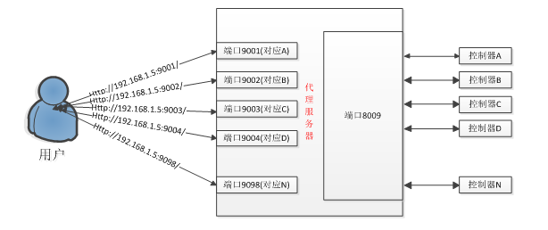

# 代理说明书

### 1.平台支持

​	代理程序是一个独立的应用程序，但为了不同操作系统的兼容，只提供dll，由用户简单调用接口生成可执行程序。Dll中的代理接口以API形式提供，名为Start_Proxy()的一个函数，调用该函数即可启动代理功能。

​	代理程序可以支持 windows/linux操作系统。

### 2.获取代理程序

* https://github.com/onbonlab/BX-Y/tree/master/bx.y.proxy


### 3.代理的运行原理



### 4.使用说明

​	API函数的详细声明请查看头文件proxy.h，头文件中有针对windows和linux的c++调用声明，也针对jna形式的java调用做了声明。

​	代理程序需要1个配置文件：proxy.xml，该文件配置控制器的侦听端口，代理端口与控制器的对应关系（用户需要填写条码与端口的一一对应）。

**xml配置文件格式如下：**

```xml
<?xml version="1.0" encoding="utf-8"?>
<config>
  <log>2</log>
  <serverip>192.168.89.100</serverip>
  <serverport>8135</serverport>
  <device>
    <card>
      <barcode>C0Y08W1902150044</barcode>
      <port>5006</port>
    </card>
    <card>
      <barcode>C0Y08W1902150045</barcode>
      <port>5007</port>
    </card>
  </device>
</config>
```

| 参数       | 说明                                                         |
| ---------- | ------------------------------------------------------------ |
| log        | 0：控制台输出日志<br>1：文件打印日志<br>2：控制台和文件一起打印日志 |
| serverip   | 服务器IP                                                     |
| serverport | 服务器端口                                                   |
| barcode    | 控制卡条码                                                   |
| port       | 自定义通讯端口【确定端口可用】                               |


​	如果需要分布式部署，那么只需将代理程序拷贝多份，并分别填写配置分件即可。

​	C++版本提供该函数的使用demo，用户可直接编译成可执行程序，作为代理程序。如果需要自己编写程序，流程和步骤请参照demo。

​	代理程序正常启动后，如果有控制器接入，就可以向代理发送http请求，URL中的IP地址为代理服务器的ip，端口为控制器对应的端口。具体命令内容参考我们的[协议文档][]。

### 5.代理应用程序使用步骤

​	1． 使用LedShowYQ软件配置控制器，使其工作在服务器模式下，详细步骤为：打开软件，添加屏幕，把要控制的屏幕添加进来，点击菜单“设置”-〉“控制器IP配置”，这是打开配置ip的界面，勾选“服务器模式”，选择“本地服务器”，输入服务器ip（这里就是代理的ip），端口自己选择（这个端口在下一步用到）。
​	2． 配置代理的配置文件“proxy.xml”，其中“serverport”即为上一步配置的端口，“barcode”为控制器的条形码，“port”在客户端url中使用，这2项都必须唯一。
​	3． 运行代理程序。
​	4． 根据协议文档发送http命令，譬如某控制器配置的对应端口为9020，假设代理的ip是192.168.100.12,那么url前缀就是http://192.168.100.12:9020/。

### 6.代理心跳和保活

​	控制器端和用户端正常断开连接，代理程序能够识别并销毁对应代理通道，所以应用程序一定要保证流程的正确。
​	 控制器端和用户端非正常断开，例如断电，拨叉网线等，socket无法正常结束，此时代理会启用tcp层的保活机制来判定某个通道是否正常，针对控制器端，如果在30秒内没有收发数据，则判定为无效，销毁通道；针对用户端，时间比较久，是2个小时（这个时间后期可以调整）。如果想快速判定通道，需要用户端定期发命令来模仿心跳机制。